# MVP – Engenharia de Dados | Pipeline de Dados na Nuvem (E-commerce Brasileiro)

**Nome:** Adson Fialho Marques  
**Matrícula:** 4052025002646  
**Sprint:** Engenharia de Dados (40530010057_20260_01)  

---

Este MVP constrói um pipeline de dados de ponta a ponta na nuvem sobre o **Brazilian E-Commerce Public Dataset by Olist**, um conjunto de dados públicos com cerca de 100 mil pedidos realizados em marketplaces brasileiros entre 2016 e 2018. Os dados permitem analisar um pedido sob múltiplas dimensões: status, preço, frete, pagamento, localização de cliente e vendedor, atributos de produto e avaliações escritas pelos clientes.

O nome do catálogo do projeto — `ecommerce_br` — foi escolhido pelo **domínio de negócio** (e-commerce brasileiro), e não pelo nome da empresa fornecedora dos dados. Essa decisão é intencional: torna o modelo reutilizável e escalável por país (por exemplo, `ecommerce_us`, `ecommerce_uk`), refletindo como uma organização real organizaria dados de e-commerce de múltiplos mercados.

## 1. Contexto de Negócio e Perguntas
_( Etapa 2 e 4.1 )_

### Objetivo Geral

> Entender como os fatores operacionais do e-commerce — prazo de entrega, custo de frete e categoria de produto — se relacionam com a satisfação do cliente e o volume de vendas, identificando padrões por região do Brasil que possam orientar melhorias na operação.

### Perguntas de Negócio

1. Atrasos na entrega reduzem a nota da avaliação?
2. Quais categorias de produto concentram as piores avaliações — e isso se relaciona com prazo de entrega ou frete?
3. Fretes mais caros geram avaliações piores?
4. Quais estados enfrentam os maiores tempos de entrega e atrasos, e quão distantes estão da média nacional?
5. Clientes mais distantes dos vendedores enfrentam fretes proporcionalmente maiores e prazos mais longos? Isso se reflete em avaliações piores?

### Estrutura dos Dados Brutos

O dataset é composto por 9 arquivos CSV relacionados por chaves, o que o torna naturalmente adequado a uma modelagem dimensional:

| Arquivo CSV | Tabela Bronze | Registros | Conteúdo |
|---|---|---|---|
| olist_customers_dataset.csv | customers | 99.441 | Clientes e localização (cidade, estado, CEP) |
| olist_geolocation_dataset.csv | geolocation | 1.000.163 | CEPs e coordenadas (lat/lng) |
| olist_orders_dataset.csv | orders | 99.441 | Pedidos: status e datas (compra, aprovação, envio, entrega prevista/real) |
| olist_order_items_dataset.csv | order_items | 112.650 | Itens de cada pedido: produto, vendedor, preço, frete |
| olist_order_payments_dataset.csv | order_payments | 103.886 | Pagamentos: tipo, parcelas, valor |
| olist_order_reviews_dataset.csv | order_reviews | 99.224 | Avaliações: nota (1–5) e comentário |
| olist_products_dataset.csv | products | 32.951 | Produtos: categoria, peso, dimensões |
| olist_sellers_dataset.csv | sellers | 3.095 | Vendedores e localização |
| product_category_name_translation.csv | category_translation | 71 | Tradução das categorias (PT → EN) |

_Nota sobre limitações do escopo:_ o dataset registra apenas pedidos efetivados — não há informação sobre carrinhos abandonados ou desistências de compra. Por isso, perguntas sobre desistência foram deliberadamente evitadas na formulação do objetivo, mantendo apenas questões respondíveis com os dados disponíveis.

### Fonte e Licença dos Dados

- **Fonte:** Kaggle — Brazilian E-Commerce Public Dataset by Olist [(`https://www.kaggle.com/datasets/olistbr/brazilian-ecommerce`)](https://www.kaggle.com/datasets/olistbr/brazilian-ecommerce).
- **Licença:** CC BY-NC 4.0 (Creative Commons Atribuição — Não Comercial). Permite uso, compartilhamento e adaptação para fins não comerciais, com atribuição. Este trabalho é acadêmico e não comercial, portanto compatível com a licença.
- **Observação sobre disponibilização:** conforme permitido pela especificação (item 5.1.4, "não é necessário a disponibilização dos dados utilizados"), os arquivos CSV **não** são versionados neste repositório. Para reproduzir, baixe o dataset da fonte acima e faça o upload conforme a seção de Carga.

---

## 2. Carga dos Dados
_Etapa 4.2_

Os 9 arquivos CSV foram baixados do Kaggle e enviados para um **Volume** do Unity Catalog (`ecommerce_br.bronze.raw_files`), que funciona como o storage de arquivos brutos do Lakehouse. O upload dos arquivos é uma etapa manual pela interface do Databricks (Catalog → Volume → Upload to this volume).

**Para reproduzir:**
1. Baixar o dataset do Kaggle (link na seção 1).
2. Descompactar os 9 arquivos CSV.
3. No Databricks, criar o Volume `ecommerce_br.bronze.raw_files` (feito por código no notebook `00 - Setup`).
4. Fazer upload dos 9 CSVs para o Volume.
5. Executar os notebooks na ordem (ver seção Pipeline).

A ingestão para tabelas Delta (camada Bronze) é feita pelo notebook `01 - Bronze - Ingestão`, detalhado na seção de Pipeline.

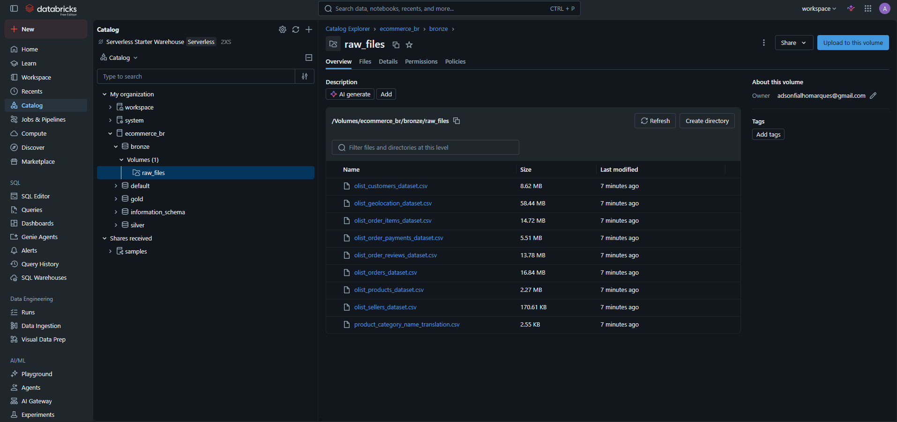
_Volume `ecommerce_br.bronze.raw_files` com os 9 arquivos CSV carregados._

---

## 3. Pipeline de Dados
_Etapa 4.4_

O pipeline segue a **Arquitetura Medalhão**, com cada camada representada por um schema dentro do catálogo `ecommerce_br`:

- **bronze** — dados crus, como vieram dos CSVs (lidos como texto), com metadados de controle.
- **silver** — dados limpos, tipados e padronizados. **(8 tabelas — concluída)**
- **gold** — modelo dimensional (esquema estrela) para análise. **(fato_vendas + 4 dimensões — concluída; Catálogo de Dados documentado no Unity Catalog)**

### Organização dos notebooks

| Notebook | Função |
|---|---|
| [`00 - Setup - Catálogo e Schemas`](notebook/00%20-%20Setup%20-%20Catálogo%20e%20Schemas.ipynb) | Criação do catálogo `ecommerce_br` e dos schemas bronze/silver/gold; criação do Volume `raw_files` |
| [`01 - Bronze - Ingestão`](notebook/01%20-%20Bronze%20-%20Ingestão.ipynb) | Ingestão dos 9 CSVs como tabelas Delta cruas (lidas como texto), com metadados de controle |
| [`02 - Silver - Limpeza e Padronização`](notebook/02%20-%20Silver%20-%20Limpeza%20e%20Padronização.ipynb) | Limpeza, tipagem e padronização por tabela (Bronze → Silver); tradução de categorias; agregações |
| [`03 - Gold - Modelagem`](notebook/03%20-%20Gold%20-%20Modelagem.ipynb) | Modelagem dimensional (esquema estrela): construção do fato_vendas e das dimensões |
| [`04 - Catálogo de Dados`](notebook/04%20-%20Catálogo%20de%20Dados.ipynb) | Documentação das tabelas e colunas Gold no Unity Catalog (comentários) |
| [`05 - Análise`](notebook/05%20-%20Análise.ipynb) | Respostas às 5 perguntas de negócio (consultas SQL + visualizações matplotlib) |

### Detalhes da ingestão Bronze

A ingestão é feita por um único laço que percorre um mapeamento arquivo→tabela, garantindo consistência entre as 9 tabelas e evitando repetição de código. Decisões técnicas relevantes:

- **Leitura como texto (`inferSchema=False`):** o Bronze preserva o dado exatamente como veio do CSV; a tipagem correta é responsabilidade da camada Silver. Essa escolha também evita inferências de tipo inconsistentes entre execuções.
- **Parsing de texto multilinha (`multiLine=True`, `quote`/`escape='"'`):** necessário porque os comentários de avaliação (order_reviews) contêm quebras de linha e vírgulas, que sem esse tratamento quebravam um registro em vários.
- **Metadados de controle:** cada tabela recebe `data_ingestao` (momento da carga) e `arquivo_origem` (rastreabilidade da fonte).
- **Escrita Delta idempotente:** `mode=overwrite` com `overwriteSchema=true`, permitindo reexecução do notebook sem duplicar dados.

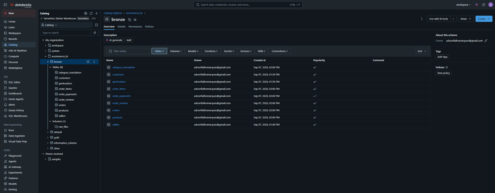
_Notebook de ingestão: as 9 tabelas Delta cruas persistidas em `ecommerce_br.bronze`, com as contagens de linhas conferidas._

### Detalhes da camada Silver

A Silver trata cada tabela individualmente (diferente do laço genérico da Bronze), pois cada uma exige transformações específicas. Foram criadas 8 tabelas; a tabela de tradução de categorias não virou tabela Silver própria (é um lookup de apoio, já incorporado em `products`). Decisões e padrões:

- **Tipagem por natureza do dado:** códigos e identificadores (CEP, IDs) mantidos como **texto** (preservam zeros à esquerda e não são operáveis); quantidades (peso, dimensões, contagens) como **inteiro**; valores monetários (`price`, `freight_value`, `payment_value`) como **decimal(10,2)** (precisão exata em centavos, evitando erro de ponto flutuante); coordenadas geográficas como **double**; datas como **timestamp** (formato ISO nativo do dataset).
- **Padronização de texto:** cidades/estados em maiúsculas com `trim`; valores de sistema já padronizados (payment_type, order_status) apenas normalizados para minúsculas.
- **Tratamento de nulos conforme o significado:** categoria de produto ausente recebeu rótulo `"indefinida"`; medidas ausentes permaneceram nulas; nulos nas datas de entrega (funil de pedidos não concluídos) foram preservados como informação legítima.
- **Enriquecimento:** tradução de categorias PT→EN incorporada em `products` via left join (com complemento manual de 2 categorias ausentes na tradução oficial).
- **Agregação:** `geolocation` foi reduzida de 1.000.163 linhas para 19.015 (uma por CEP) via média de latitude/longitude, produzindo um ponto representativo por prefixo — base para o cálculo de distância cliente×vendedor.
- **Linhagem:** cada tabela Silver recebe `data_processamento_silver` (carimbo do momento de processamento da camada).

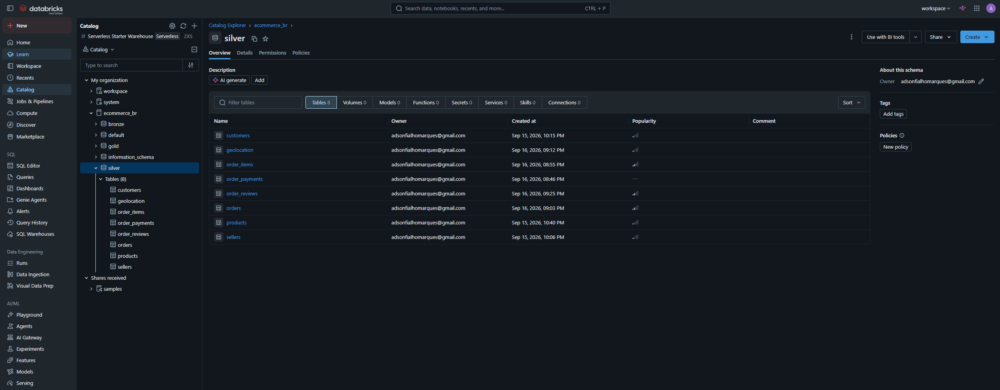
_As 8 tabelas tratadas persistidas em `ecommerce_br.silver`._

---

## 4. Modelagem e Catálogo de Dados
_Etapa 4.3_

A camada Gold adota um **esquema estrela**, com uma tabela fato central cercada por dimensões descritivas. Essa estrutura é otimizada para as perguntas do MVP, que têm a forma "métrica por dimensão".

### Modelo dimensional

- **`fato_vendas`** — tabela fato no grão de **item de pedido** (112.650 linhas). Reúne as chaves de ligação (order_id, order_item_id, product_id, seller_id, customer_id) e as métricas de negócio: preço, frete, prazo de entrega (dias), atraso (dias) e nota da avaliação. As métricas de entrega são calculadas a partir das datas do pedido; a nota vem das avaliações.
- **`dim_produto`** — atributos do produto (categoria em português e inglês, peso, dimensões). 32.951 produtos.
- **`dim_cliente`** — cliente e localização (cidade, estado, CEP, coordenadas geográficas). Mantém os dois identificadores (customer_id por pedido e customer_unique_id da pessoa). 99.441 registros.
- **`dim_vendedor`** — vendedor e localização (com coordenadas geográficas). 3.095 vendedores.
- **`dim_tempo`** — data da compra desdobrada (ano, mês, dia, trimestre, nome do mês, dia da semana). 616 datas.

As coordenadas geográficas em `dim_cliente` e `dim_vendedor` foram obtidas por junção com a geolocation pelo CEP, habilitando o cálculo de distância cliente×vendedor (P5). Um pequeno número de registros ficou sem coordenada (7 vendedores, 278 clientes) por CEPs ausentes na geolocation — esses não entram no cálculo de distância.

As cinco tabelas do modelo dimensional ficam persistidas no schema `gold`:

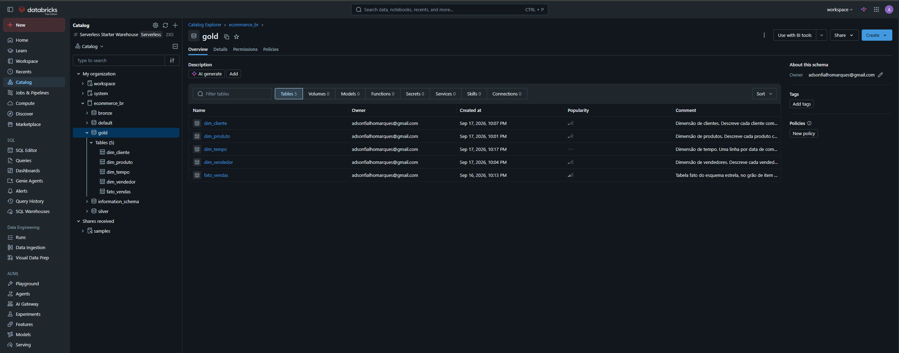
_As 4 dimensões e a tabela fato em `ecommerce_br.gold`, com as descrições visíveis na coluna de comentários._

### Decisões de modelagem

- **Grão do fato = item de pedido:** permite analisar por produto, vendedor e categoria. Como a nota da avaliação está no grão de pedido, ela se repete entre os itens do mesmo pedido (granularidade mista consciente) — nas análises de satisfação, a nota é contada uma vez por pedido quando necessário.
- **Deduplicação de avaliações:** 547 pedidos possuíam mais de uma avaliação; manteve-se a mais recente (opinião final do cliente), evitando multiplicação de linhas no fato.
- **Métricas derivadas:** `prazo_entrega_dias` (entrega − compra) e `atraso_dias` (entrega − previsão) foram pré-calculadas no fato; ficam nulas para pedidos não entregues (comportamento correto).
- **dim_tempo incluída além do necessário:** as 5 perguntas não exigem análise temporal, mas a dimensão foi criada para completar o modelo dimensional e habilitar análises futuras de sazonalidade.

### Catálogo de Dados

O modelo Gold está documentado no **Unity Catalog** por meio de comentários de tabela e de coluna (comandos `COMMENT ON TABLE` e `ALTER COLUMN ... COMMENT`), registrados no notebook `04 - Catálogo de Dados`. Cada coluna tem descrição de significado, unidade, domínio de valores e comportamento de nulos. A documentação é navegável na interface do Databricks.

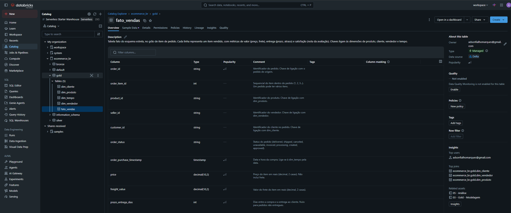
_Catálogo de Dados: comentários de cada coluna do `fato_vendas` no Unity Catalog, com significado, unidade e domínio de valores._

### Visão geral do modelo

O diagrama abaixo consolida o esquema estrela: a tabela fato `fato_vendas` ao centro, cercada pelas quatro dimensões.

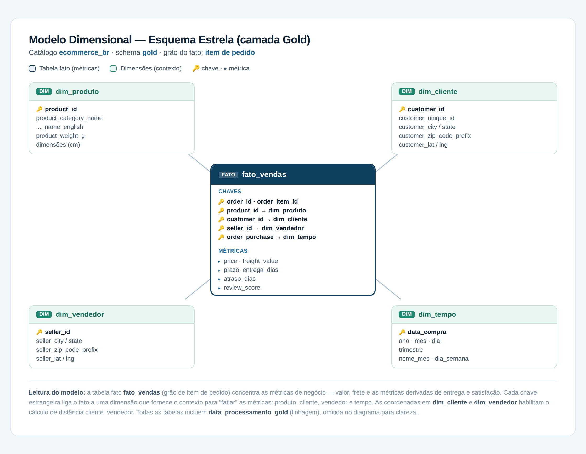

---

## 5. Qualidade de Dados
_Etapa 4.5_

Achados registrados na ingestão Bronze:

- **Conferência de contagem pós-carga:** a validação do número de linhas de cada tabela contra o dataset original detectou uma anomalia em `order_reviews` (104.162 linhas lidas vs. 99.224 esperadas), causada por registros partidos por quebras de linha nos comentários. Corrigido com parsing multilinha, restaurando as 99.224 avaliações corretas.
- **Inconsistência de tipos com inferência automática:** o uso de `inferSchema` gerou conflito de tipos entre execuções. A decisão de ler tudo como texto no Bronze (tipando apenas na Silver) tornou a ingestão determinística.

Achados registrados na camada Silver:

- **Preservação de códigos como texto (acurácia):** CEPs (`zip_code_prefix`) foram mantidos como texto, não convertidos para número, para preservar zeros à esquerda (ex.: `04195`) — a conversão para inteiro quebraria futuras junções por CEP.
- **Unicidade:** conferência de duplicatas em sellers (3.095) e customers (99.441) — nenhuma duplicata encontrada.
- **Distinção de identificadores (customers):** a base tem 99.441 registros (`customer_id`, por pedido) mas 96.096 clientes reais (`customer_unique_id`), revelando ~3,4% de compras recorrentes.
- **Completude e tratamento de nulos por tipo (products):** categoria ausente em 610 produtos (1,85%) recebeu rótulo explícito `"indefinida"` (preservando o produto nas análises); peso/dimensões ausentes em 2 produtos (0,01%) foram mantidos nulos (ausência de medida não equivale a zero).
- **Integridade referencial (products × tradução):** 13 produtos em 2 categorias reais (`pc_gamer`, `portateis_cozinha_e_preparadores_de_alimentos`) não tinham correspondência na tabela de tradução oficial do Olist; as traduções foram complementadas manualmente para recuperar a informação.
- **Consistência de datas (order_items, orders):** após converter texto para timestamp, confirmou-se que nenhuma data válida virou nulo por erro de parsing (contagem de nulos idêntica antes e depois da conversão).
- **Funil de entrega (orders):** os nulos nas 5 datas crescem ao longo das etapas (aprovação 0,16% → transportadora 1,79% → entrega ao cliente 2,98%), refletindo pedidos que não completaram o ciclo (cancelados, indisponíveis, em trânsito). São nulos legítimos e foram preservados — a análise de prazos filtrará apenas pedidos entregues.
- **Validação de domínio (order_reviews):** a nota (`review_score`) contém apenas valores de 1 a 5, sem nulos — domínio íntegro. Distribuição: ~77% das avaliações são positivas (notas 4–5), com a nota 1 mais frequente que a 2 e a 3 (padrão de polarização).

Achados registrados na camada Gold:

- **Unicidade de avaliações (Gold):** ao montar o fato, a junção com as avaliações revelou 547 pedidos com mais de uma avaliação, o que multiplicaria os itens. Tratado mantendo a avaliação mais recente por pedido (window function), restaurando o grão correto.
- **Coerência das métricas de entrega (Gold):** os atrasos calculados são majoritariamente negativos, indicando que os pedidos costumam ser entregues antes da data prevista — a estimativa de entrega do marketplace é conservadora.

---

## 6. Análise de Dados
_Etapa 4.5_

As análises foram feitas com consultas SQL sobre o modelo dimensional (camada Gold) e visualizações em matplotlib, no notebook `05 - Análise`. Nota metodológica: análises que envolvem a nota são feitas por pedido (a nota é do pedido, não do item), exceto quando a dimensão é o produto/categoria — nesse caso, por item; consideram-se apenas pedidos entregues e avaliados ao cruzar entrega e satisfação.

### P1 — Atrasos na entrega reduzem a nota da avaliação?

**Sim, de forma contundente.** A nota média cai de **4,29** (pedidos adiantados) para **4,03** (no prazo) e despenca para **2,27** (atrasados) — uma queda de mais de 2 pontos numa escala de 5. Além disso, entregar "no prazo" já é pior que "adiantado": o cliente valoriza receber antes do previsto, não apenas na data. Como cerca de 92% dos pedidos são entregues adiantados, isso ajuda a explicar a predominância de notas altas na base.

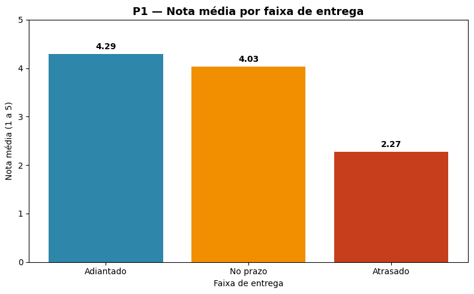  
_Nota média por faixa de entrega: a satisfação despenca quando há atraso._

### P2 — Quais categorias concentram as piores avaliações, e isso se relaciona com prazo ou frete?

As piores categorias são dominadas por **móveis e itens volumosos**. A pior, `moveis_escritorio` (nota **3,51**), combina o maior prazo de entrega (**20,8 dias**, ~60% acima da média) com frete elevado (**R$ 40,12**). O padrão sugere que o **prazo tem relação mais forte com a insatisfação do que o frete isolado** — categorias com frete alto mas prazo normal mantêm notas razoáveis. Produtos grandes enfrentam um desafio logístico (frete caro + entrega lenta) que se reflete na avaliação.

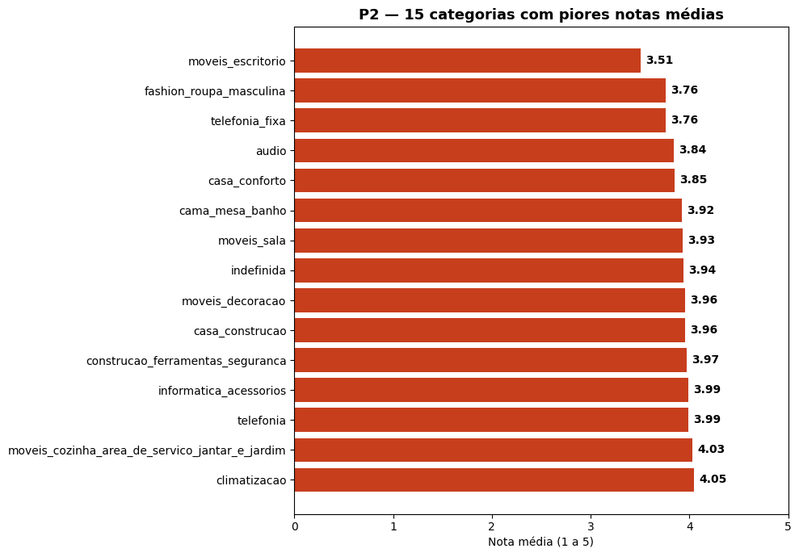  
_Top 15 categorias com as menores notas médias e relação com frete e prazo._

### P3 — Fretes mais caros geram avaliações piores?

**Sim, mas de forma modesta.** No valor absoluto, a nota cai de **4,12** (frete até R$10) para **3,89** (acima de R$50). Na proporção frete/preço, o pior caso é quando o frete custa mais que o próprio produto (nota **3,84**). Em ambas as visões, a queda é de apenas ~0,23 ponto — muito menor que o impacto do atraso. O custo do frete tem, portanto, impacto secundário na satisfação.

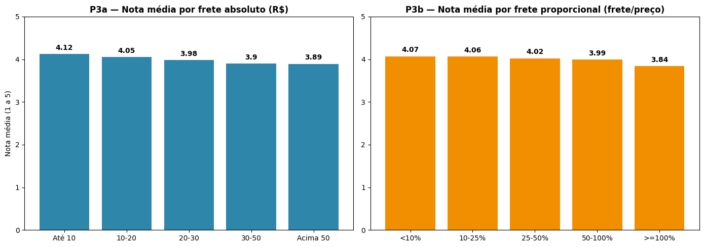  
_Impacto do frete (absoluto e proporcional ao preço) sobre a nota média._

### P4 — Quais estados têm os maiores prazos e atrasos, e quão distantes estão da média nacional?

Há forte **desigualdade logística regional**. Os estados do Norte/Nordeste lideram os maiores prazos: Roraima (**29,3 dias**), Amapá (27,2) e Amazonas (26,4), contra a média nacional de **12,5 dias** e apenas **8,7 dias** em São Paulo. Um achado importante: mesmo os estados mais lentos entregam **antes do prazo previsto** (Roraima tem atraso médio de -17,3 dias). O marketplace **calibra a expectativa por região** — promete prazos longos para áreas distantes e os cumpre. A insatisfação desses clientes tende a vir do tempo absoluto de espera, não do descumprimento da promessa.

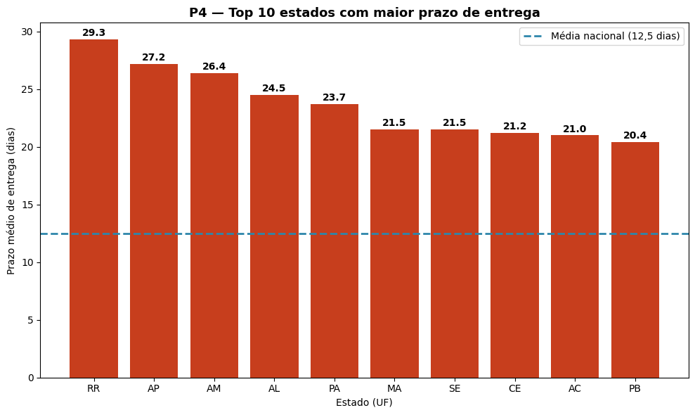  
_Prazos médios de entrega por unidade federativa em comparação com a média nacional._

### P5 — Clientes mais distantes enfrentam fretes/prazos maiores e notas piores?

A distância (calculada pela fórmula de Haversine entre as coordenadas de cliente e vendedor) tem impacto **forte na operação, modesto na percepção**. De "até 50 km" para "acima de 1000 km": o frete médio quase triplica (R$ 11,48 → R$ 31,65), chega a representar 43% do preço, e o prazo mais que triplica (6,1 → 19,0 dias). A nota, porém, cai apenas de **4,22 para 3,96**.

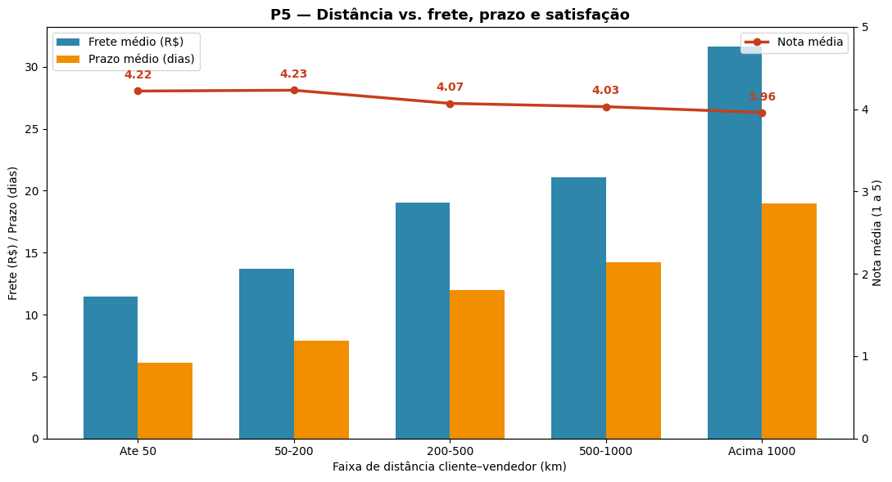  
_Evolução do custo de frete, prazo de entrega e nota média conforme a distância geográfica._

### Discussão geral

Cruzando as cinco análises, emerge uma conclusão central: **entre os fatores operacionais, o atraso — a quebra da expectativa — é de longe o maior determinante da satisfação** (derruba a nota em mais de 2 pontos). Distância, frete e prazo longo têm impacto real na operação e no custo, mas impacto pequeno na percepção do cliente, desde que a promessa de entrega seja cumprida. O marketplace administra bem essa expectativa (calibra prazos por região e entrega adiantado na maioria dos casos), o que sustenta a alta proporção de avaliações positivas. Para melhorar a satisfação, o foco mais eficaz seria reduzir atrasos — especialmente nas categorias de produtos volumosos e nas rotas de longa distância, onde o risco logístico é maior.

---

### Visão Geral do Projeto
> Plataforma: **Databricks Free Edition** · Arquitetura: **Lakehouse (Medalhão Bronze → Silver → Gold)** · Tabelas **Delta Lake**
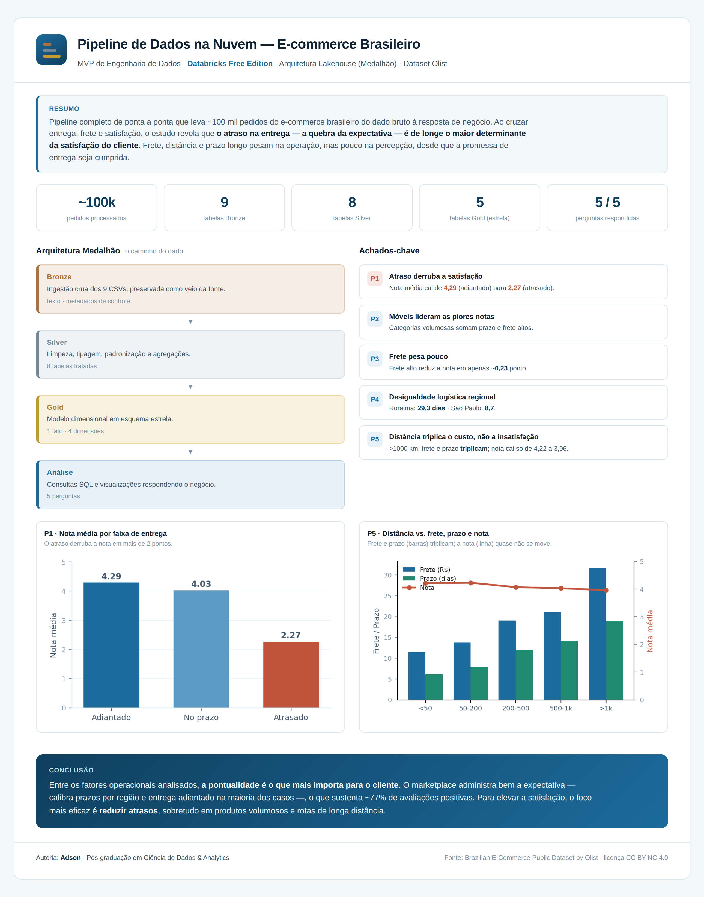

---

## 7. Autoavaliação

### Atingimento dos objetivos

O objetivo central do MVP — construir um pipeline de dados de ponta a ponta na nuvem e usá-lo para responder perguntas de negócio sobre a operação do e-commerce — foi alcançado. O pipeline percorre todas as etapas propostas (coleta, armazenamento, modelagem, transformação e análise) sobre a Arquitetura Medalhão, e as cinco perguntas definidas no início foram respondidas com base no modelo dimensional construído.

### Status de cada pergunta

1. **Atrasos reduzem a nota?** — Respondida. Relação clara e forte: a nota cai de 4,29 (adiantado) para 2,27 (atrasado).
2. **Categorias com piores avaliações e relação com prazo/frete?** — Respondida. Móveis e itens volumosos concentram as piores notas, associadas a prazo e frete altos.
3. **Fretes mais caros geram avaliações piores?** — Respondida. Sim, mas com impacto modesto (~0,23 ponto), tanto no valor absoluto quanto na proporção frete/preço.
4. **Estados com maiores prazos/atrasos vs. média nacional?** — Respondida. Ranking completo por estado, com a distância de cada um em relação à média nacional.
5. **Distância cliente–vendedor vs. frete, prazo e nota?** — Respondida, com uma limitação: 285 registros (7 vendedores e 278 clientes, ~0,3% do total) não tinham coordenada geográfica na base e ficaram fora do cálculo de distância. Como a proporção é mínima, isso não compromete as conclusões, mas é registrado por transparência.

### Dificuldades encontradas

- **Parsing de textos multilinha (Bronze):** os comentários das avaliações contêm quebras de linha e vírgulas, que faziam um único registro ser lido como vários, inflando a contagem de linhas. Foi necessário ajustar a leitura do CSV (multiLine e tratamento de aspas) para preservar a integridade dos registros.
- **Inferência de tipos inconsistente:** deixar o Spark inferir os tipos gerava resultados diferentes entre execuções e conflitos de schema. A solução foi ler tudo como texto na camada Bronze e concentrar a tipagem correta na Silver — uma decisão que tornou a ingestão determinística e reforçou a separação de responsabilidades entre camadas.
- **Avaliações duplicadas:** 547 pedidos possuíam mais de uma avaliação, o que multiplicava os itens ao montar o fato. Resolver isso exigiu aprender e aplicar uma window function para manter apenas a avaliação mais recente por pedido.
- **Cálculo de distância geográfica (Haversine):** a pergunta sobre distância exigiu implementar a fórmula de Haversine em SQL, a parte mais técnica da análise, para converter pares de coordenadas em distância real entre cliente e vendedor.

Cada uma dessas dificuldades foi também um aprendizado sobre como um problema aparentemente simples de dados esconde armadilhas que só a verificação cuidadosa (como a conferência de contagem após cada etapa) revela.

### Trabalhos futuros

- **Análise de sazonalidade temporal:** a dimensão de tempo foi construída (ano, mês, trimestre, dia da semana), mas as cinco perguntas não exploram a evolução ao longo do tempo. Um próximo passo natural é analisar tendências e efeitos sazonais nas vendas e na satisfação.
- **Análise de texto das avaliações:** os comentários escritos pelos clientes (presentes em parte das avaliações) não foram explorados; técnicas de processamento de linguagem natural poderiam extrair os principais motivos de insatisfação.
- **Comportamento de clientes recorrentes:** usando o identificador único de cliente, seria possível estudar recompra e fidelização (a base tem ~3,4% de clientes recorrentes).
- **Enriquecimento com dados externos:** cruzar a análise geográfica com dados demográficos ou regionais poderia aprofundar o entendimento das diferenças logísticas entre regiões.

---

## Reprodutibilidade — Resumo

1. Criar conta no Databricks Free Edition.
2. Baixar o dataset do Kaggle e descompactar os 9 CSVs.
3. Executar `00 - Setup` (cria catálogo, schemas e Volume).
4. Fazer upload dos 9 CSVs para o Volume `ecommerce_br.bronze.raw_files`.
5. Executar os notebooks na ordem: `01 - Bronze - Ingestão` → `02 - Silver - Limpeza e Padronização` → `03 - Gold - Modelagem` → `04 - Catálogo de Dados` → `05 - Análise`.
